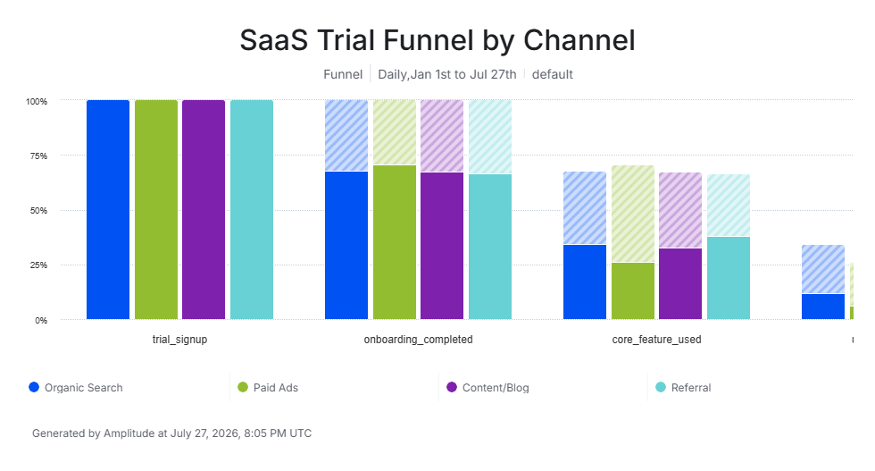
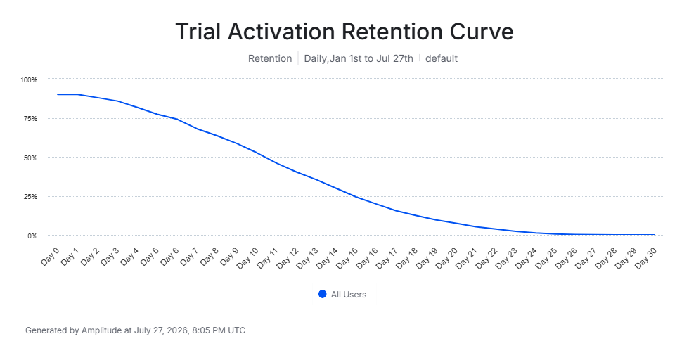

# SaaS Trial Activation & Channel Conversion Analysis

Product analytics case study diagnosing why free-trial signups fail to convert to paid, using **Amplitude** for funnel and retention analysis.

> **Dataset note:** This project uses a synthetic, self-generated event dataset built to mirror realistic SaaS trial dynamics. It is not real company data — this is disclosed here transparently and should be disclosed the same way anywhere this project is referenced.

## Problem

Free-trial SaaS products often see healthy signup volume but weak paid conversion, with no clear visibility into *where* in the trial journey users disengage or *whether* the drop-off is consistent across acquisition channels. This project simulates that scenario to practice diagnosing the leak with a real product analytics platform rather than raw SQL/Python alone.

## Approach

1. **Generated a synthetic event dataset** (`generate_data.py`) — 6,000 trial users, 17,644 timestamped events, modeling a 4-stage user journey: `trial_signup` → `onboarding_completed` → `core_feature_used` (activation) → `upgraded_to_paid`, plus recurring `app_session` engagement events. Conversion and activation rates vary by acquisition channel (Organic Search, Paid Ads, Referral, Content/Blog) to create a realistic, investigable pattern.
2. **Loaded the data into Amplitude** via the Batch Event Upload API (`upload_to_amplitude.py`), since Amplitude's UI-based CSV import only supports schema/event definitions, not raw behavioral data.
3. **Built a funnel analysis** in Amplitude across all 4 stages, segmented by acquisition channel.
4. **Built a retention analysis** anchored on the activation event (`core_feature_used`), tracking day-by-day return behavior over a 30-day window.

## Key Findings

- **Overall trial-to-paid conversion: 10.2%** (611 of 6,000 signups)
- **Activation — not retention — is the real leak.** Only 31.9% of signups ever reach the core activation event, but of those who do, **89.9% return within 7 days.** The problem isn't keeping users engaged once they activate — it's getting them to activate in the first place.
- **~3x gap in trial-to-paid conversion by acquisition channel:** Referral converts at 16.5%, versus just 6.0% for Paid Ads.
- **Retention decays steadily after activation** — from 89.9% on Day 1 down to under 10% by Day 20.

### Funnel by Channel

### Retention Curve (anchored on activation)

## Tools

- **Amplitude** — Funnel Analysis, Retention Analysis, event segmentation, Batch Event Upload API
- **Python** — synthetic data generation, event formatting, API upload script

## Files

| File | Description |
|---|---|
| `generate_data.py` | Generates the synthetic 6,000-user event dataset |
| `saas_trial_events.csv` | The generated event-level dataset (17,644 rows) |
| `upload_to_amplitude.py` | Uploads the dataset to Amplitude via the Batch Event Upload API |
| `screenshots/` | Funnel and retention charts built in Amplitude |

---
*Built by Matthew Koch — [LinkedIn](https://www.linkedin.com/in/matthew-koch-297352280) | [GitHub](https://github.com/mattkoch146)*
